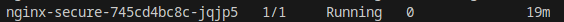
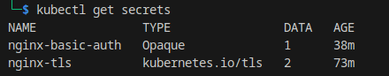
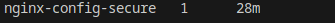
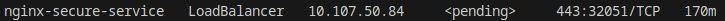
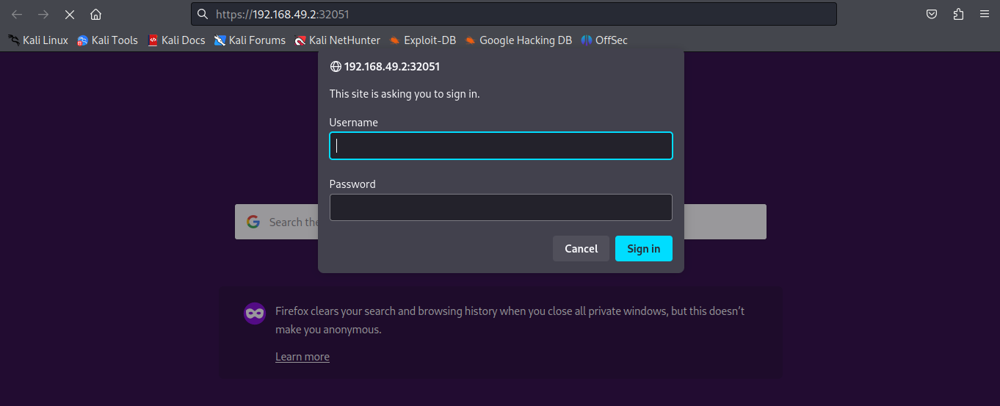
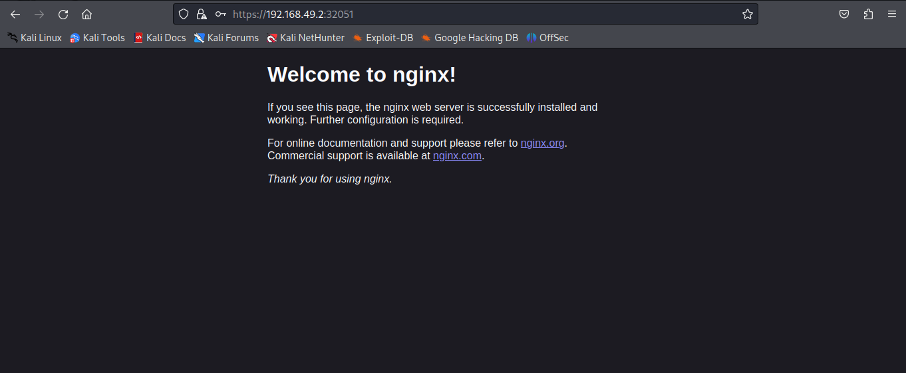

# 🧰 Nginx Secure Pod – SSL + Basic Auth (Kubernetes)

## 📖 Overview

This project demonstrates how to deploy an **Nginx web server on Kubernetes**, secured with:

* ✅ **HTTPS (SSL/TLS)**
* 🔒 **Basic Authentication** (username & password protection)

It uses:

* **ConfigMap** for custom Nginx configuration
* **Secrets** for storing TLS certificates and authentication credentials
* **Deployment** to run the Nginx container
* **Service** to expose it over port 443

---

## ⚙️ Steps to Reproduce

### 1️⃣ Generate SSL Certificates

You can create a **self-signed SSL certificate** for testing:

```bash
mkdir -p certs
openssl req -x509 -nodes -days 365 \
  -newkey rsa:2048 \
  -keyout ./certs/tls.key \
  -out ./certs/tls.crt \
  -subj "/CN=localhost"
```

---

### 2️⃣ Create Basic Authentication File

Install Apache utilities and generate credentials:

```bash
sudo apt install apache2-utils -y
mkdir -p auth
htpasswd -c ./auth/htpasswd admin
# Enter password when prompted
```

---

### 3️⃣ Create Kubernetes Secrets

#### SSL Secret

```bash
kubectl create secret tls nginx-tls \
  --cert=./certs/tls.crt \
  --key=./certs/tls.key
```

#### Basic Auth Secret

```bash
kubectl create secret generic nginx-basic-auth \
  --from-file=auth/htpasswd
```

---

### 4️⃣ Create ConfigMap for Nginx Configuration

Apply:

```bash
kubectl apply -f k8/configmap.yaml
```

---

### 5️⃣ Deploy Nginx Pod and Service

Apply the deployment and service files:

```bash
kubectl apply -f k8/deployment.yaml
kubectl apply -f k8/service.yaml
```

---

### 6️⃣ Verify Deployment

Check that everything is running properly:

#### 🧩 Get Pods



---

#### 🔐 Get Secrets



---

#### ⚙️ Get ConfigMaps



---

#### 🌐 Get Services



---

### 7️⃣ Test in Browser

1. Copy the **Minikube-IP**:

   ```bash
   minikube ip
   ```

2. Open in browser:
   `https://minikube-ip:port`

3. You’ll see a **Basic Auth popup** — enter:

   ```
   Username: admin
   Password: <your password>
   ```

  


4. After successful login, you’ll see the **Nginx welcome page**.

  

---

## 🧩 Kubernetes Components Summary

| Resource       | Name                   | Purpose                                   |
| -------------- | ---------------------- | ----------------------------------------- |
| **Secret**     | `nginx-tls`            | Stores SSL cert and private key           |
| **Secret**     | `nginx-basic-auth`     | Stores htpasswd credentials               |
| **ConfigMap**  | `nginx-config`         | Holds Nginx configuration with SSL & auth |
| **Deployment** | `nginx-secure`         | Runs Nginx pod                            |
| **Service**    | `nginx-secure-service` | Exposes Nginx on port 443                 |

---

## ✅ Result

You now have a fully functional **Nginx Pod** running on **Kubernetes**, protected by:

* SSL Encryption (HTTPS)
* Basic Authentication

This setup is ideal for testing secure access to internal dashboards, APIs, or admin tools within a cluster.
