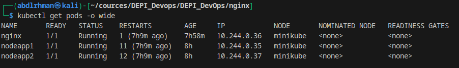

# 🚀 Kubernetes Nginx Reverse Proxy with Node.js Apps

## 📌 Project Overview
This project demonstrates deploying two Node.js applications on Kubernetes and configuring **Nginx** as a **reverse proxy and load balancer** to distribute traffic between them.

### Task Requirements
1. Dockerize two Node.js applications.
2. Push the images to Docker Hub.
3. Create Kubernetes Pods for each app and expose them via Services.
4. Deploy an Nginx Pod with a ConfigMap:
   - Acts as a reverse proxy.
   - Balances traffic between the two Node.js apps.
5. Verify functionality using `kubectl` commands and a web browser.

---

## ⚙️ Setup Steps

### 1. Dockerize and Push Node.js Apps
- Built Docker images:
  - `abdlrhman00/nodeapp1:latest`
  - `abdlrhman00/nodeapp2:latest`
- Pushed to Docker Hub:
```bash
docker build -t abdlrhman00/nodeapp1:latest ./nodeapp1
docker build -t abdlrhman00/nodeapp2:latest ./nodeapp2
docker push abdlrhman00/nodeapp1:latest
docker push abdlrhman00/nodeapp2:latest
```

### 2. Kubernetes Resources

* **Pods & Services** for Node.js apps.
* **ConfigMap** for Nginx load balancing.
* **Nginx Pod & Service** (NodePort) for external access.

### 3. Nginx Config

The Nginx reverse proxy config (via ConfigMap):

```nginx
upstream nodeapps {
    server nodeapp1-service:80;
    server nodeapp2-service:80;
}

server {
    listen 80;
    location / {
        proxy_pass http://nodeapps;
    }
}
```

### 4. Verification

Ran the following commands to verify:

```bash
kubectl get pods
kubectl get svc
kubectl get configmap
kubectl describe pod nginx
```

Accessed the app in browser using the NodePort:

```
http://<node-ip>:<node-port>
```

Each refresh alternates responses between NodeApp1 and NodeApp2.

---

## 📸 Screenshots

### ✅ Pods Running



### ✅ Services


### ✅ ConfigMap


### ✅ Describe Nginx Pod


### ✅ Web Browser Test


---

## 🚀 Result

* Node.js apps run inside Kubernetes Pods.
* Exposed with Services (ClusterIP).
* Nginx reverse proxy (NodePort) distributes traffic between both apps.
* Verified using browser and `kubectl` commands.
